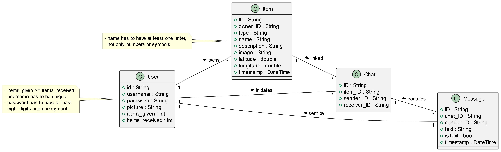

<!-- Template file for README.md for LEIC-ES-2023-24 -->

<!-- > [!NOTE] In this file, you’ll find the structure you should follow to document your mobile app in the README.md file for LEIC-ES-2024-25. It’s a single file with guidelines. You can add more sections, but for assessment normalisation and automation, include all sections of this template. Your professors will clarify about specificities of your app. -->

# _ItemSwap_ Development Report

Welcome to the documentation pages of _ItemSwap_!

This Software Development Report, tailored for LEIC-ES-2024-25, provides comprehensive details about _ItemSwap_, from high-level vision to low-level implementation decisions. It’s organised by the following activities.

* [Business modeling](#Business-Modelling)
    * [Product Vision](#Product-Vision)
    * [Features and Assumptions](#Features-and-Assumptions)
    * [Elevator Pitch](#Elevator-pitch)
* [Requirements](#Requirements)
    * [User stories](#User-stories)
    * [Domain model](#Domain-model)
* [Architecture and Design](#Architecture-And-Design)
    * [Logical architecture](#Logical-Architecture)
    * [Physical architecture](#Physical-Architecture)
    * [Vertical prototype](#Vertical-Prototype)
* [Project management](#Project-Management)
    * [Sprint 0](#Sprint-0)
    * [Sprint 1](#Sprint-1)
    * [Sprint 2](#Sprint-2)
    * [Sprint 3](#Sprint-3)
    * [Sprint 4](#Sprint-4)
    * [Final Release](#Final-Release)

Contributions are expected to be made exclusively by the initial team, but we may open them to the community, after the course, in all areas and topics: requirements, technologies, development, experimentation, testing, etc.

Please contact us!

Thank you!

* [Casemiro Melo](https://sigarra.up.pt/feup/pt/fest_geral.cursos_list?pv_num_unico=202301897) up202301897@up.pt
* [Gil Andrade](https://sigarra.up.pt/feup/pt/fest_geral.cursos_list?pv_num_unico=201604138) up201604138@up.pt
* [Henrique Perry](https://sigarra.up.pt/feup/pt/fest_geral.cursos_list?pv_num_unico=202306582) up202306582@up.pt
* [José Torres](https://sigarra.up.pt/feup/pt/fest_geral.cursos_list?pv_num_unico=202307047) up202307047@up.pt
* [Tiago Monteiro](https://sigarra.up.pt/feup/pt/fest_geral.cursos_list?pv_num_unico=202305179) up202305179@up.pt

---
## Business Modelling
<!-- should we write something here? -->

Business modeling in software development involves defining the product's vision, understanding market needs, aligning features with user expectations, and setting the groundwork for strategic planning and execution.

### Product Vision

#### **Overview**  
ItemSwap is a social impact app that aims to reduce waste, promote sustainability, and help people in need by facilitating the free exchange of items. It allows users to donate items they no longer need, browse for items they could benefit from, and connect with others to exchange goods. ItemSwap ensures that goods are reused, reducing the environmental impact of consumer culture and providing access to essentials for those who may not be able to afford them.

---

#### **Target Audience**  
- **Individuals in need**: People who can’t afford to buy new items but require specific goods.  
- **Environmentally-conscious users**: Individuals looking to reduce their consumption and make more sustainable choices.  
- **General public**: Anyone with unused items at home looking to make a positive impact by donating them.

#### **Value Proposition:**

##### **For Users**  
ItemSwap gives people the chance to give back to their communities by donating unused goods and helps them find things they need for free. Users can feel good about the positive impact they’re making on the environment and the lives of others.
   
##### **For Society**  
The app fosters a culture of generosity and sustainability. It gives people an easy way to contribute to a circular economy, reducing waste and giving new life to items that would otherwise end up in landfills.

##### **For the Environment**  
By ensuring that goods are reused, ItemSwap helps prevent the wasteful disposal of items, reducing pollution, lowering carbon footprints, and conserving resources.

---

#### **Long-term Vision:**

##### **Global Expansion**  
ItemSwap aims to expand globally, building a worldwide community of users who share their items for free, with the potential to partner with organizations and governments for larger-scale impact.
   
##### **Expanded Services**  
Future features could include partnerships with local charities, integration with recycling programs, and the option to coordinate item swaps at community centers or through local events.

##### **Improved Accessibility**  
As ItemSwap grows, the platform can introduce additional accessibility features, such as language translations, assistance for users with disabilities, and further development to enhance the experience for people in various economic situations.

---

ItemSwap’s vision is to create a more sustainable world where everyone has access to the resources they need, and where every item finds a second life, reducing waste and making a real difference in people's lives.

<!-- 
Start by defining a clear and concise vision for your app, to help members of the team, contributors, and users into focusing their often disparate views into a concise, visual, and short textual form. 

The vision should provide a "high concept" of the product for marketers, developers, and managers.

A product vision describes the essential of the product and sets the direction to where a product is headed, and what the product will deliver in the future. 

**We favor a catchy and concise statement, ideally one sentence.**

We suggest you use the product vision template described in the following link:
(For, Who, The, Is a, That, Unlike, Our product)
* [How To Create A Convincing Product Vision To Guide Your Team, by uxstudioteam.com](https://uxstudioteam.com/ux-blog/product-vision/)

To learn more about how to write a good product vision, please see:
* [Vision, by scrumbook.org](http://scrumbook.org/value-stream/vision.html)
* [Product Management: Product Vision, by ProductPlan](https://www.productplan.com/glossary/product-vision/)
* [How to write a vision, by dummies.com](https://www.dummies.com/business/marketing/branding/how-to-write-vision-and-mission-statements-for-your-brand/)
* [20 Inspiring Vision Statement Examples (2019 Updated), by lifehack.org](https://www.lifehack.org/articles/work/20-sample-vision-statement-for-the-new-startup.html)
-->

### Features and Assumptions

<!-- features -->
#### **1. Item Posting**
- Users can easily upload photos of the items they no longer need by filling out a simple form with essential details: type of item, name, description, image, location (latitude and longitude). This helps others find items in their area.
- **Types of items**: 
   Art & Decor,
  Baby Products,
  Books,
  Clothing,
  Collectibles,
  Electronics,
  Food & Beverages,
  Furniture,
  Garden & Outdoor,
  Health & Beauty,
  Home Appliances,
  Industrial Equipment,
  Jewelry & Accessories,
  Musical Instruments,
  Office Supplies,
  Pet Supplies,
  Sports Equipment,
  Tools & Hardware,
  Toys & Games,
  Transports,
  Other.

#### **2. Search and Browse**  
- Users can search for items they need by type, keyword, location, or simply by time.
- A powerful search functionality ensures users can find what they’re looking for.

#### **3. Chat and Communication**  
- When a user finds an item they want, they can initiate a chat with the item’s owner to discuss the details, such as condition, availability, and logistics.
- The chat function ensures safe and easy communication between users to coordinate the exchange of items.

#### **4. Item Swapped**  
- Once a successful exchange is made, both parties mark the item as "swapped." This removes the item from the database, ensuring it’s no longer available for others and maintaining the integrity of the system.
- Both parties are notified when the swap is completed.

#### **5. User Profiles**  
- Each user has a profile where they can customize their picture, username, and password. This fosters trust within the community.
- A **transaction history** displays the number of items they’ve given and received, showcasing their activity and contribution to the platform.

#### **6. Sustainability and Social Impact**  
- ItemSwap emphasizes eco-friendliness by promoting the reuse of goods instead of sending them to landfills. The app's design highlights the importance of reducing waste and reusing items to help the environment.

#### **7. Free Transactions**  
- All transactions within ItemSwap are completely free. There are no costs involved, ensuring that everyone has equal access to the items they need, regardless of their financial situation. This supports people who cannot afford to buy new goods.

#### **8. Location-based Services**  
- Location features allow users to search for items within a certain radius of their location. This makes the exchange process easier and more feasible for people to arrange meetups or deliveries locally.

#### **9. Notifications and Alerts**  
- Users receive notifications when they receive a message in the chat. Notifications help keep the process active and engaging.

<!-- 
Indicate an  initial/tentative list of high-level features - high-level capabilities or desired services of the system that are necessary to deliver benefits to the users.
 - Feature XPTO - a few words to briefly describe the feature
 - Feature ABCD - ...
...

Optionally, indicate an initial/tentative list of assumptions that you are doing about the app and dependencies of the app to other systems.
-->

<!-- assumptions/dependencies -->

### Elevator Pitch

ItemSwap is the ultimate app for giving and getting completely for free! It’s where you can list things you no longer need, from clothes to gadgets, and share them with others in your community. Simply upload your item with a name, description, picture, and location. If someone finds something they want, they can chat with you and click ‘Item Swapped’ once it’s done. Your items stay out of landfills, and people in need get access to things they might not be able to afford. With ItemSwap, it’s all about sustainability, accessibility, and building a world where sharing is the norm. No money, no hassle, just a simple swap

<!-- 
Draft a small text to help you quickly introduce and describe your product in a short time (lift travel time ~90 seconds) and a few words (~800 characters), a technique usually known as elevator pitch.

Take a look at the following links to learn some techniques:
* [Crafting an Elevator Pitch](https://www.mindtools.com/pages/article/elevator-pitch.htm)
* [The Best Elevator Pitch Examples, Templates, and Tactics - A Guide to Writing an Unforgettable Elevator Speech, by strategypeak.com](https://strategypeak.com/elevator-pitch-examples/)
* [Top 7 Killer Elevator Pitch Examples, by toggl.com](https://blog.toggl.com/elevator-pitch-examples/)
-->

## Requirements

### User Stories
<!-- 
In this section, you should describe all kinds of requirements for your module: functional and non-functional requirements.

For LEIC-ES-2024-25, the requirements will be gathered and documented as user stories. 

Please add in this section a concise summary of all the user stories.

**User stories as GitHub Project Items**
The user stories themselves should be created and described as items in your GitHub Project with the label "user story". 

A user story is a description of a desired functionality told from the perspective of the user or customer. A starting template for the description of a user story is *As a < user role >, I want < goal > so that < reason >.*

Name the item with either the full user story or a shorter name. In the “comments” field, add relevant notes, mockup images, and acceptance test scenarios, linking to the acceptance test in Gherkin when available, and finally estimate value and effort.

**INVEST in good user stories**. 
You may add more details after, but the shorter and complete, the better. In order to decide if the user story is good, please follow the [INVEST guidelines](https://xp123.com/articles/invest-in-good-stories-and-smart-tasks/).

**User interface mockups**.
After the user story text, you should add a draft of the corresponding user interfaces, a simple mockup or draft, if applicable.

**Acceptance tests**.
For each user story you should write also the acceptance tests (textually in [Gherkin](https://cucumber.io/docs/gherkin/reference/)), i.e., a description of scenarios (situations) that will help to confirm that the system satisfies the requirements addressed by the user story.

**Value and effort**.
At the end, it is good to add a rough indication of the value of the user story to the customers (e.g. [MoSCoW](https://en.wikipedia.org/wiki/MoSCoW_method) method) and the team should add an estimation of the effort to implement it, for example, using points in a kind-of-a Fibonnacci scale (1,2,3,5,8,13,20,40, no idea).

-->
#### User Story 1: User Authentication and Profile Management
As a user, I want to create an account with a username, profile picture, and password, log in securely, and update my profile details so that I can access my account, manage my information, and track the number of items I have given and received.

#### User Story 2: Main Page (Navigation and Features)
As a user, I want a main page with a mean to access my recent chats, change my profile, search for items, and view the items I have given so that I can easily navigate the app and access important features.

#### User Story 3: Adding and Removing Items
As a user, I want to add an item with its name, description, image, location, and type, and later remove it from the database either by marking it as swapped or deleting it manually so that I have full control over the items I share and can keep the item list up to date.

  

#### User Story 4: Search and Filters
As a user, I want to search for items by name, filter by type and date of posting, and see nearby items first so that I can quickly find what I need in a convenient location.

  

#### User Story 5: Chat System (Requesting Items and Communication)
As a user, I want to start a chat with an item’s owner, exchange messages, and view a list of my recent chats so that I can communicate about an item exchange efficiently.

  

  

#### User Story 6: Tracking Items Given & Received
As a user, I want to see a section displaying the number of items I have given and received so that I can track my contributions and benefits from the app.

### Domain model

<!-- 
To better understand the context of the software system, it is useful to have a simple UML class diagram with all and only the key concepts (names, attributes) and relationships involved of the problem domain addressed by your app. 
Also provide a short textual description of each concept (domain class). 

Example:
 

  

-->

## Architecture and Design
<!--
The architecture of a software system encompasses the set of key decisions about its organization. 

A well written architecture document is brief and reduces the amount of time it takes new programmers to a project to understand the code to feel able to make modifications and enhancements.

To document the architecture requires describing the decomposition of the system in their parts (high-level components) and the key behaviors and collaborations between them. 

In this section you should start by briefly describing the components of the project and their interrelations. You should describe how you solved typical problems you may have encountered, pointing to well-known architectural and design patterns, if applicable.
-->

### Logical architecture
<!--
The purpose of this subsection is to document the high-level logical structure of the code (Logical View), using a UML diagram with logical packages, without the worry of allocating to components, processes or machines.

It can be beneficial to present the system in a horizontal decomposition, defining layers and implementation concepts, such as the user interface, business logic and concepts.

Example of _UML package diagram_ showing a _logical view_ of the Eletronic Ticketing System (to be accompanied by a short description of each package):

-->

### Physical architecture
<!--
The goal of this subsection is to document the high-level physical structure of the software system (machines, connections, software components installed, and their dependencies) using UML deployment diagrams (Deployment View) or component diagrams (Implementation View), separate or integrated, showing the physical structure of the system.

It should describe also the technologies considered and justify the selections made. Examples of technologies relevant for ESOF are, for example, frameworks for mobile applications (such as Flutter).

Example of _UML deployment diagram_ showing a _deployment view_ of the Eletronic Ticketing System (please notice that, instead of software components, one should represent their physical/executable manifestations for deployment, called artifacts in UML; the diagram should be accompanied by a short description of each node and artifact):

-->

### Vertical prototype
<!--
To help on validating all the architectural, design and technological decisions made, we usually implement a vertical prototype, a thin vertical slice of the system integrating as much technologies we can.

In this subsection please describe which feature, or part of it, you have implemented, and how, together with a snapshot of the user interface, if applicable.

At this phase, instead of a complete user story, you can simply implement a small part of a feature that demonstrates thay you can use the technology, for example, show a screen with the app credits (name and authors).
-->

## Project management
<!--
Software project management is the art and science of planning and leading software projects, in which software projects are planned, implemented, monitored and controlled.

In the context of ESOF, we recommend each team to adopt a set of project management practices and tools capable of registering tasks, assigning tasks to team members, adding estimations to tasks, monitor tasks progress, and therefore being able to track their projects.

Common practices of managing agile software development with Scrum are: backlog management, release management, estimation, Sprint planning, Sprint development, acceptance tests, and Sprint retrospectives.

You can find below information and references related with the project management: 

* Backlog management: Product backlog and Sprint backlog in a [Github Projects board](https://github.com/orgs/FEUP-LEIC-ES-2023-24/projects/64);
* Release management: [v0](#), v1, v2, v3, ...;
* Sprint planning and retrospectives: 
  * plans: screenshots of Github Projects board at begin and end of each Sprint;
  * retrospectives: meeting notes in a document in the repository, addressing the following questions:
    * Did well: things we did well and should continue;
    * Do differently: things we should do differently and how;
    * Puzzles: things we don’t know yet if they are right or wrong… 
    * list of a few improvements to implement next Sprint;

-->

### Sprint 0

### Sprint 1

### Sprint 2

### Sprint 3

### Sprint 4

### Final Release
